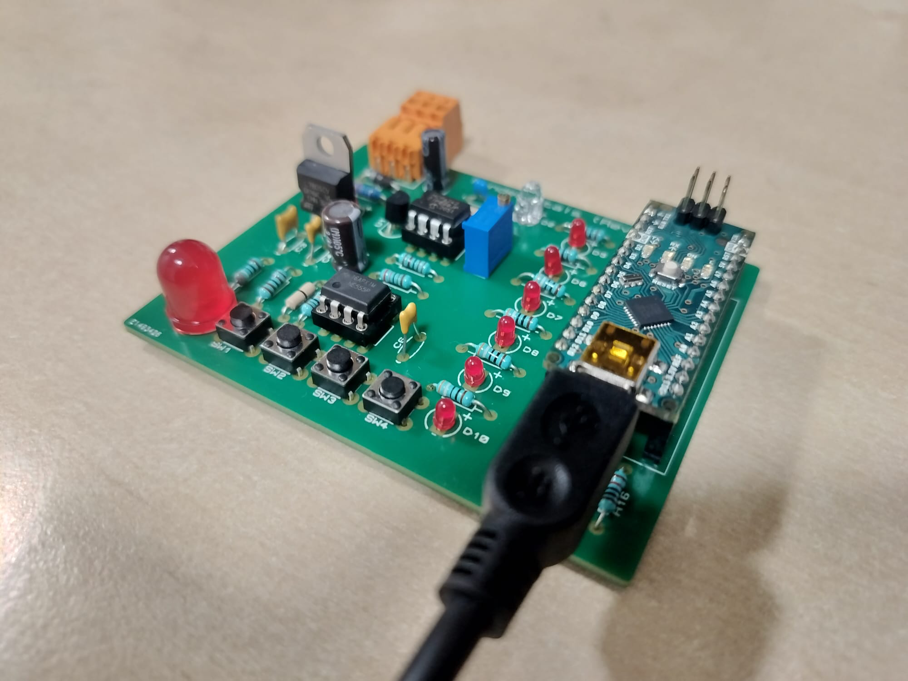
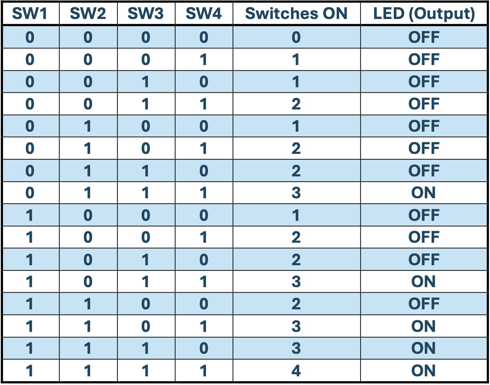
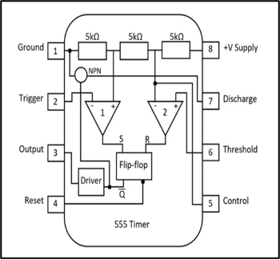
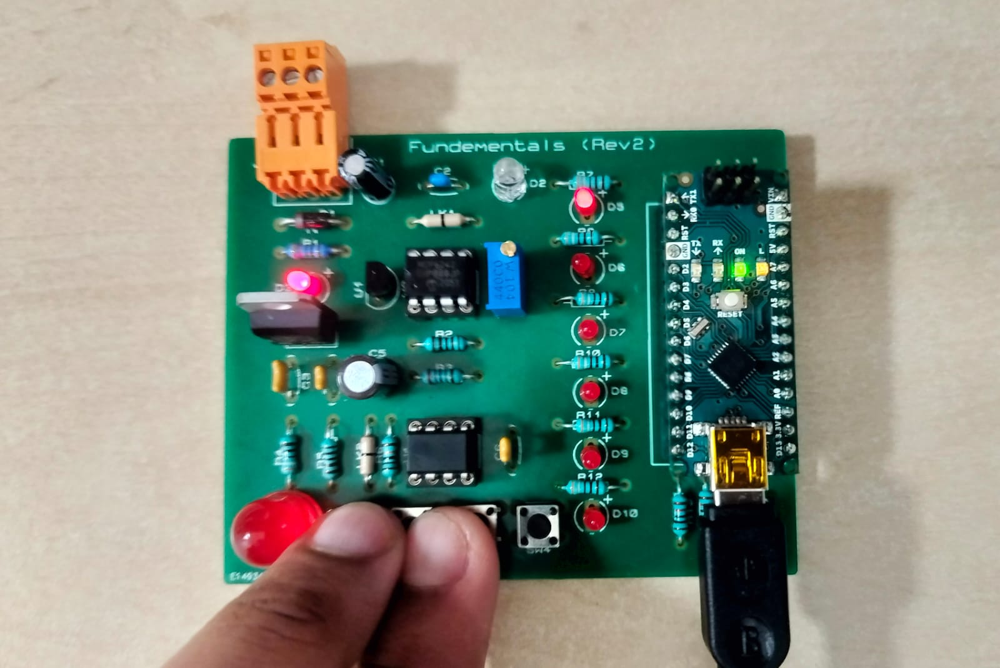
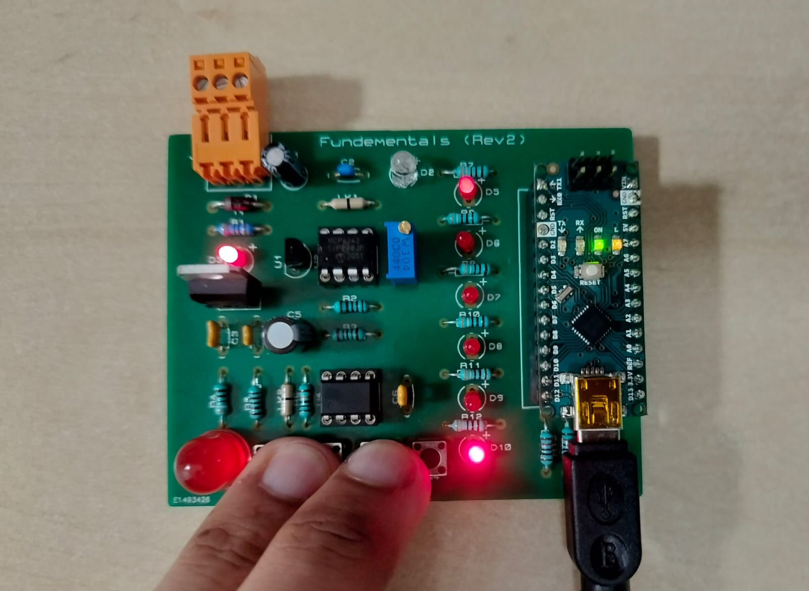
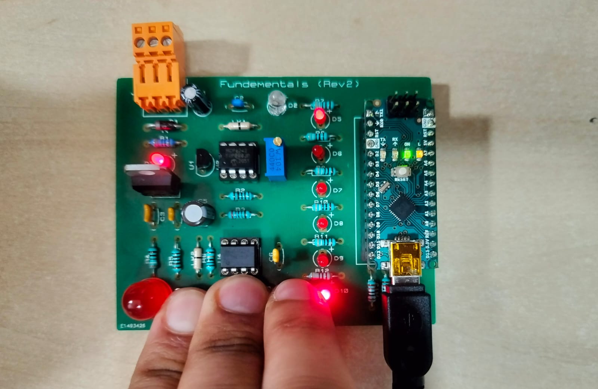
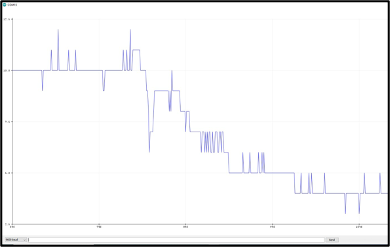
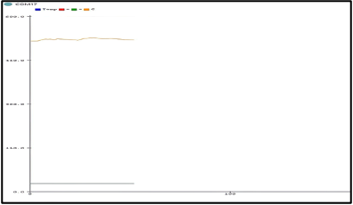

# Synapse-Rig


> **Engineered for Precision.** A comprehensive embedded systems repository showcasing a custom-soldered PCB rig integrating combinational digital logic, operational amplifiers, and asynchronous timing circuits.

| Completed Synapse-Rig Hardware Assembly | 
| :---: | 
|  |

---

## 1. Executive Summary
Synapse-Rig is a sophisticated hardware-software interface developed to demonstrate the practical application of digital logic, signal processing, and embedded systems engineering. Utilising an **Arduino Nano** as the central processing unit, the rig facilitates real-time data collection and logical decision-making. The project spans two primary engineering domains: **Combinational Computing** (Majority Voting Logic) and **Electrical Engineering** (Analog Signal Conditioning & Timing).

---

## 2. System Architecture & Circuitry
The hardware was developed on a custom PCB, necessitating precision soldering and component integration. The architecture incorporates advanced analog components to bridge the gap between physical sensors and digital microcontrollers.

| Full System Schematic (Proteus PCB Design) | 
| :---: | 
|  |

### Core Components
* **Operational Amplifier (MCP6242):** Utilised in a trans-impedance configuration to buffer and amplify weak analog signals from the photoresistor (LDR). 
* **NE555 Timer:** Configured in **Monostable Mode** to generate precise asynchronous timing pulses. 
* **UA7805C Voltage Regulator:** Ensures a stable 5V power rail for noise-sensitive analog thermal sensors. 
* **Combinational Input Array:** A 4-switch push-button interface for digital logic simulation. 
---

## 3. Combinational Voting Logic
The primary computing objective was to synthesise a "majority-vote" decision-making system. The system analyses four concurrent inputs ($SW1-SW4$) to determine if a majority threshold ($\ge 3$) is met. 

### Mathematical & Logical Framework
The logic is governed by the following Boolean expression: $$Z = \overline{A}BC\overline{D} + \overline{A}BCD + A\overline{B}CD + AB\overline{C}D + ABCD$$ 


| Logic Truth Table (16 Combinations) | Internal NE555 Timer Architecture |
| :---: | :---: |
|  |  |

### Hardware Validation
The software-simulated combinational logic was physically validated by monitoring the LED output against various switch combinations. 


| 2 Switches (Fail) | 3 Switches (Pass) | 4 Switches (Pass) |
| :---: | :---: | :---: |
|  |  |  |

---

## 4. Analog Signal Analysis
Beyond digital logic, the rig serves as an analog sensing platform. Using the Arduino Serial Plotter, high-fidelity voltage signals were recorded and analysed to verify sensor performance and signal conditioning accuracy.

| LDR Signal Conditioning Graph | Thermal Stability Analysis |
| :---: | :---: |
|  |  |

### Timing Precision (NE555)
The timing network utilises a $100k\Omega$ resistor ($R$) and a $100\mu F$ capacitor ($C$). Theoretical pulse duration was calculated using the monostable formula: $$t = 1.1 \times R \times C$$
* **Calculated Duration:** $11.00$ Seconds
* **Measured Duration:** $12.46$ Seconds
* **Deviation:** $13.27\%$ (Attributed to component tolerances and electrolytic leakage).

---

## 5. Software Implementation
The logic is driven by a highly optimised C++ script. The software performs continuous polling of the input pins, calculates the active switch count, and drives the active-LOW LED output.

```cpp
void loop() {
  switchesPressed = 0; // Reset count each cycle

  // Poll input switch states
  if (digitalRead(SW1) == HIGH) switchesPressed++;
  if (digitalRead(SW2) == HIGH) switchesPressed++;
  if (digitalRead(SW3) == HIGH) switchesPressed++;
  if (digitalRead(SW4) == HIGH) switchesPressed++;

  // Majority Logic: Trigger LED if count >= 3
  if (switchesPressed >= 3) {
    digitalWrite(LED, LOW);  // Active LOW - ON
  } else {
    digitalWrite(LED, HIGH); // OFF
  }
  
  delay(100); // Stability debounce
}
```
## 6. Setup & Usage

**Hardware Connection:** Connect the Synapse-Rig to a host PC via Micro USB.

**Environment:** Open `Voting_Logic.ino` in VS Code or Arduino IDE.

**Compilation:** Ensure the board is set to `Arduino Nano` with the `ATmega328P processor`.

**Deployment:** Upload the code and monitor switch states via the onboard LEDs or Serial Monitor.

---
*Developed by Sri Vigneswaran under the [MIT License](./LICENSE)*
